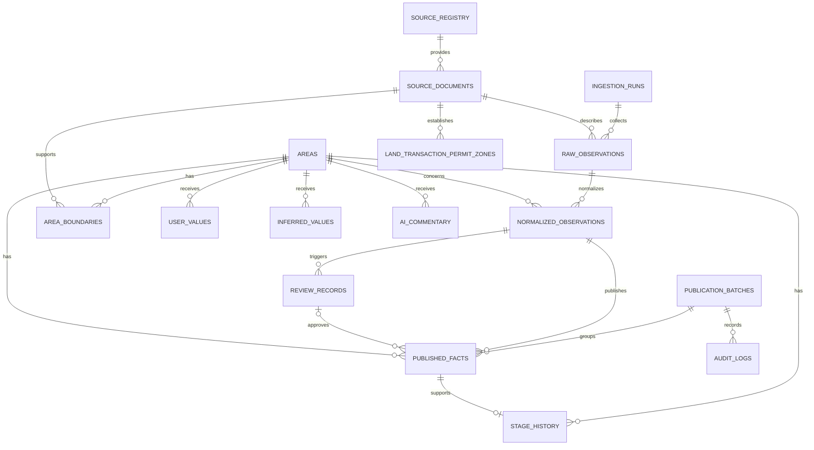

# DATABASE - Redevelopment OS

## 1. 목적과 설계 범위

이 문서는 `DATA_SOURCES.md`와 `DATA_QUALITY.md`의 승인된 정책을 데이터베이스 구조로 옮긴 논리 설계안이다. SQL 마이그레이션, Supabase 연결, 권한 정책과 실제 API 연동은 이 문서의 범위가 아니다.

설계 목표는 다음과 같다.

1. 모든 공식 사실을 원 출처와 효력일까지 추적한다.
2. 원시 관측, 정규화 관측, 검토, 게시와 감사 단계를 분리한다.
3. `stage_history`를 사업 단계의 단일 진실 공급원으로 사용한다.
4. 공식 사실, 사용자 입력, 추론값과 AI 해설을 서로 다른 저장 계층으로 분리한다.
5. 단일 사용자 MVP에서 운영 가능하되 다중 사용자·자동 수집으로 확장할 수 있게 한다.

## 2. 핵심 설계 원칙

- `stage_history`가 사업 단계의 유일한 원본이다. `areas.current_stage`는 승인된 단계 이력으로부터 계산되는 읽기용 캐시이며 직접 수정하지 않는다.
- `areas.lifecycle_status`는 사업 단계와 별개이며 `active`, `suspended`, `cancelled`, `released`, `merged`, `superseded`만 사용한다.
- 제공자 메타데이터는 `source_registry`, 개별 고시·공고·인가서·데이터셋·파일 또는 API 요청 범위의 출처 identity는 `source_documents`에 저장한다. 개별 API 응답 payload는 `raw_observations`에만 저장한다. 업무 테이블은 `source_document_id`를 참조하며 `source_url`과 `source_identifier`를 반복 저장하지 않는다.
- 일반 공식 관측은 출처·스키마·중복·참조 무결성·신뢰도·충돌 검사를 통과하면 `auto_checked`로 게시할 수 있다.
- 정비구역 지정·취소, 핵심 인가 단계, 토지거래허가구역, 공식 경계, 구역 병합·분할 등 중요 변경은 `verified`와 승인된 `review_record`가 있어야 게시할 수 있다.
- `official_boundary`는 행정기관이 직접 제공한 geometry이고, `derived_boundary`는 공식 문서에서 디지타이징하거나 변환한 geometry다. 두 유형은 절대 같은 것으로 표시하지 않는다.
- 원시·정규화·게시 버전은 덮어쓰지 않고 추가하며, 현재값은 버전과 유효기간에서 선택하거나 재구축한다.
- `last_verified_at`은 사람이 실제 검토한 경우에만 기록한다.

## 3. 엔터티 관계 개요

`audit_logs`는 그림에 표시된 게시 작업뿐 아니라 모든 주요 엔터티의 생성·검토·게시·롤백 이벤트를 다형 참조로 기록한다.

## 4. 상태와 공통 규칙

### 4.1 검증 상태

`verification_status`는 다음 값을 사용한다.

- `unverified`
- `auto_checked`
- `review_required`
- `verified`
- `rejected`
- `superseded`
- `stale`

일반 공식 관측의 최소 게시 상태는 `auto_checked`, 중요 공식 변경의 최소 게시 상태는 `verified`다.

### 4.2 시간과 버전

- 모든 타임스탬프는 UTC로 저장한다.
- `fetched_at`은 취득 시각, `effective_date`는 법적·업무상 효력일, `last_verified_at`은 실제 사람 검토 시각이다.
- 유효기간이 필요한 사실은 `effective_from`, `effective_to`를 사용하고 종료 전이면 `effective_to`를 `null`로 둔다.
- 원본과 게시 버전은 물리 삭제하거나 제자리 수정하지 않고 `superseded_by_id`, 새 버전 또는 취소 이벤트로 연결한다.

### 4.3 식별자와 데이터형

- 기본 키는 기본적으로 UUID를 사용한다.
- 원문 payload는 허용 범위에 따라 `jsonb`, 객체 저장소 URI 또는 해시만 저장한다.
- geometry는 공간 확장 사용 여부 결정 전 논리형 `geometry`로 표기한다.
- 제한 값은 DB enum 또는 `check` 제약 중 하나로 구현하되 MVP 구현 전에 방식을 확정한다.

## 5. 핵심 및 공간 테이블 설계

### 5.1 `areas`

- 목적: 정비사업 구역의 안정적인 식별자와 검색용 현재 요약을 제공한다.
- 중요 컬럼: `id`, `slug`, `canonical_name`, `district_code`, `representative_address`, `representative_point`, `project_type`, `lifecycle_status`, `current_stage`, `current_stage_history_id`, `created_at`, `updated_at`.
- 기본 키: `id`.
- 외래 키: `current_stage_history_id -> stage_history.id`(순환 참조를 피하기 위해 초기 생성 후 nullable), 병합·대체 관계가 필요하면 `successor_area_id -> areas.id`.
- 중요 제약: `slug` unique; `lifecycle_status` 허용값 제한; `current_stage`와 `current_stage_history_id`는 파생 캐시이므로 직접 입력·수정 금지; 대표 좌표를 공식 경계로 해석하지 않음.
- 인덱스: unique(`slug`), (`district_code`, `project_type`), (`lifecycle_status`), 공간 인덱스(`representative_point`)는 지도 도입 시.
- 단계: **MVP Phase 1**.
- 단일 진실 공급원: 구역 식별과 생애주기 관계. 사업 단계의 원본은 아님.
- 파생 캐시: `current_stage`, `current_stage_history_id`; 필요하면 승인된 게시 사실에서 계산한 현재 세대수·면적도 별도 캐시로 추가 가능.

### 5.2 `source_registry`

- 목적: 제공자와 데이터셋 단위의 접근·이용·갱신 정책을 중앙 관리한다.
- 중요 컬럼: `id`, `provider_name`, `dataset_name`, `dataset_identifier`, `service_identifier`, `access_method`, `authentication_method`, `response_format`, `legal_effect_status`, `license_status`, `automation_status`, `provider_update_frequency`, `polling_frequency`, `reconciliation_frequency`, `implementation_readiness`, `terms_checked_at`, `created_at`, `updated_at`.
- 기본 키: `id`.
- 외래 키: 없음.
- 중요 제약: 제공자와 데이터셋 식별자의 조합 unique(식별자가 미확정이면 부분 unique); 법적 효력·자동화·구현 준비 상태 허용값 제한.
- 인덱스: (`provider_name`), (`implementation_readiness`), (`automation_status`).
- 단계: **MVP Phase 1**.
- 단일 진실 공급원: 데이터 제공자·데이터셋 수준 정책과 접근 메타데이터.
- 파생 캐시: 없음.

### 5.3 `source_documents`

- 목적: 개별 고시·공고·인가서와 같은 제공자 문서, 데이터셋, 공식 파일 또는 API 요청 범위의 출처 메타데이터와 identity를 한 번만 저장한다. API의 개별 응답 payload 저장소로 사용하지 않는다.
- 중요 컬럼: `id`, `source_registry_id`, `source_identifier`, `source_url`, `document_type`, `request_scope_identity`, `title`, `issued_at`, `effective_date`, `content_hash`, `storage_uri`, `legal_effect_status`, `supersedes_document_id`, `created_at`.
- 기본 키: `id`.
- 외래 키: `source_registry_id -> source_registry.id`, `supersedes_document_id -> source_documents.id`.
- 중요 제약: 제공되는 경우 unique(`source_registry_id`, `source_identifier`); URL이 없으면 부재 사유 필요; 문서·파일 원문 저장은 제공자 조건을 준수; API 응답 payload를 `raw_observations`와 중복 저장하지 않음.
- 인덱스: (`source_registry_id`, `source_identifier`), (`document_type`, `effective_date`), (`content_hash`).
- 단계: **MVP Phase 1**.
- 단일 진실 공급원: `source_url`, `source_identifier`와 문서 수준 효력 메타데이터.
- 파생 캐시: 없음.

### 5.4 `ingestion_runs`

- 목적: 수집 실행, 재시도, 실패와 재현 정보를 배치 단위로 기록한다.
- 중요 컬럼: `id`, `source_registry_id`, `started_at`, `finished_at`, `status`, `collection_method`, `collector_version`, `requested_scope`, `attempt_number`, `records_received`, `records_failed`, `error_code`, `error_summary`, `retry_after`, `created_at`.
- 기본 키: `id`.
- 외래 키: `source_registry_id -> source_registry.id`, 선택적으로 `retry_of_run_id -> ingestion_runs.id`.
- 중요 제약: 완료 상태에는 `finished_at` 필수; 시도 횟수는 1 이상; 실패가 성공처럼 갱신 시각을 변경하지 않음.
- 인덱스: (`source_registry_id`, `started_at` desc), (`status`, `started_at`), (`retry_of_run_id`).
- 단계: **MVP Phase 2** — 첫 공식 수집 파이프라인. Phase 1의 수동 입력에는 수집 실행 생성을 요구하지 않는다.
- 단일 진실 공급원: 수집 작업 실행 결과.
- 파생 캐시: 성공·실패 건수는 원시 레코드에서 재계산 가능한 운영 캐시.

### 5.5 `raw_observations`

- 목적: 수집한 원본 응답 또는 허용된 원본 참조를 불변 관측으로 보존한다.
- 중요 컬럼: `id`, `ingestion_run_id`, `source_document_id`, `provider_record_key`, `fetched_at`, `collection_method`, `payload`, `storage_uri`, `content_hash`, `http_status`, `parser_candidate_version`, `retention_until`, `created_at`.
- 기본 키: `id`.
- 외래 키: `ingestion_run_id -> ingestion_runs.id`, `source_document_id -> source_documents.id`.
- 중요 제약: `payload`, `storage_uri`, 해시·메타데이터 조합 중 보존 정책이 요구하는 값 필수; 동일 실행의 제공자 키·해시 중복 방지; 원본 수정 금지.
- 인덱스: (`ingestion_run_id`), (`source_document_id`), (`provider_record_key`), (`content_hash`), (`fetched_at`).
- 단계: **MVP Phase 2** — 첫 공식 수집 파이프라인.
- 단일 진실 공급원: 실제 취득한 원시 관측과 취득 시각.
- 파생 캐시: 없음.

### 5.6 `normalized_observations`

- 목적: 원시 관측을 주소·단위·필드 기준에 맞춘 후보 사실로 저장한다.
- 중요 컬럼: `id`, `raw_observation_id`, `area_id`, `fact_type`, `attribute_key`, `normalized_value`, `unit`, `effective_date`, `parser_version`, `confidence_level`, `verification_status`, `deduplication_key`, `conflict_group_id`, `stale_after`, `superseded_by_id`, `created_at`.
- 기본 키: `id`.
- 외래 키: `raw_observation_id -> raw_observations.id`, `area_id -> areas.id`, `superseded_by_id -> normalized_observations.id`.
- 중요 제약: `parser_version`, `confidence_level`, `verification_status` 필수; 공식 관측은 원시 관측 없이 생성 금지; 한 레코드는 한 원자적 사실을 표현; `last_verified_at`을 자동 생성하지 않음.
- 인덱스: (`area_id`, `fact_type`, `effective_date`), (`verification_status`), (`deduplication_key`), (`conflict_group_id`), (`stale_after`).
- 단계: **MVP Phase 2** — 첫 공식 수집 파이프라인.
- 단일 진실 공급원: 파싱·정규화 결과와 자동 품질 상태. 서비스에 게시된 사실의 원본은 아님.
- 파생 캐시: 중복·충돌 탐지 키는 입력에서 계산 가능.

### 5.7 `review_records`

- 목적: 중요 변경, 충돌, 낮은 신뢰도와 수동 승인 결정을 보존한다.
- 중요 컬럼: `id`, `normalized_observation_id`, `review_type`, `status`, `previous_published_fact_id`, `proposed_value`, `difference_summary`, `threshold_rule_version`, `reviewer_label`, `decision`, `decision_reason`, `requested_at`, `reviewed_at`, `last_verified_at`, `created_at`.
- 기본 키: `id`.
- 외래 키: `normalized_observation_id -> normalized_observations.id`, nullable `previous_published_fact_id -> published_facts.id`.
- 중요 제약: 이전 게시값이 없는 신규 사실이면 `previous_published_fact_id`는 `null`; MVP 승인자는 한 명; 승인·기각에는 `reviewed_at`, `last_verified_at`, 검토자와 사유 필수; `last_verified_at`은 실제 원문 대조 후에만 기록.
- 인덱스: (`status`, `requested_at`), (`normalized_observation_id`), (`reviewed_at`).
- 단계: **MVP Phase 2** — 첫 공식 수집 파이프라인.
- 단일 진실 공급원: 사람 검토 요청과 결정.
- 파생 캐시: `difference_summary`는 이전값·후보값에서 재계산 가능.

삽입 순서는 후보 `normalized_observation` 생성, `review_record` 생성과 승인, 승인 결과를 참조하는 `published_fact` 생성이다. 이전 게시값이 없으면 검토 레코드의 `previous_published_fact_id`는 비워 둔다.

### 5.8 `publication_batches`

- 목적: 함께 게시된 변경 묶음을 식별하고 원자적 게시·롤백 단위를 제공한다.
- 중요 컬럼: `id`, `status`, `created_by`, `published_at`, `rolled_back_at`, `rollback_of_batch_id`, `reason`, `created_at`.
- 기본 키: `id`.
- 외래 키: `rollback_of_batch_id -> publication_batches.id`.
- 중요 제약: 게시 완료에는 `published_at` 필수; 롤백은 원 배치를 참조하고 사유 필수; 기존 배치 삭제 금지.
- 인덱스: (`status`, `published_at`), (`rollback_of_batch_id`).
- 단계: **MVP Phase 2** — 첫 공식 수집 파이프라인.
- 단일 진실 공급원: 게시와 롤백의 작업 단위.
- 파생 캐시: 없음.

### 5.9 `published_facts`

- 목적: 품질 기준을 통과해 서비스가 사용할 공식 사실의 버전 이력을 제공한다.
- 중요 컬럼: `id`, `area_id`, `normalized_observation_id`, `source_document_id`, `review_record_id`, `publication_batch_id`, `fact_type`, `attribute_key`, `published_value`, `unit`, `effective_from`, `effective_to`, `verification_status`, `last_verified_at`, `superseded_by_id`, `published_at`, `created_at`.
- 기본 키: `id`.
- 외래 키: `area_id -> areas.id`, nullable `normalized_observation_id -> normalized_observations.id`, `source_document_id -> source_documents.id`, nullable `review_record_id -> review_records.id`, nullable `publication_batch_id -> publication_batches.id`, `superseded_by_id -> published_facts.id`.
- 중요 제약: Phase 1의 수동 등록은 `normalized_observation_id`와 `publication_batch_id`가 `null`일 수 있으나 `source_document_id`는 필수; 일반 공식 관측은 `auto_checked` 이상이며 `review_record_id`가 `null`일 수 있음; 중요 변경은 `verified`와 승인된 `review_record_id` 필수; `last_verified_at`은 사람 검토가 있었을 때만 존재; 동일 구역·속성의 유효기간 중복 금지 또는 충돌 격리; 직접 덮어쓰기 금지.
- 인덱스: (`area_id`, `attribute_key`, `effective_from` desc), 부분 인덱스(`effective_to is null`), (`source_document_id`), (`publication_batch_id`), (`verification_status`).
- 단계: **MVP Phase 1** — 수동 검증 사실부터 사용하고 Phase 2에서 정규화 관측·게시 배치와 연결한다.
- 단일 진실 공급원: 현재 및 과거의 게시 가능한 공식 사실. 단, 사업 단계는 `stage_history`가 최종 원본이다.
- 파생 캐시: 현재 사실 조회 뷰 또는 materialized view는 여기에서 계산 가능.

### 5.10 `stage_history`

- 목적: 사업 단계의 승인된 전체 이력과 정정·취소 관계를 보존한다.
- 중요 컬럼: `id`, `area_id`, `stage_code`, `effective_date`, `published_fact_id`, `source_document_id`, `verification_status`, `review_record_id`, `supersedes_stage_history_id`, `recorded_at`.
- 기본 키: `id`.
- 외래 키: `area_id -> areas.id`, `published_fact_id -> published_facts.id`, `source_document_id -> source_documents.id`, `review_record_id -> review_records.id`, `supersedes_stage_history_id -> stage_history.id`.
- 중요 제약: 사업 단계의 **단일 진실 공급원**; 중요 단계 변경은 `verified`와 승인 검토 필수; 승인된 stage 유형 `published_fact`가 게시될 때 `stage_history`를 생성할 수 있으며 두 레코드는 하나의 원자적 트랜잭션으로 기록; 이력 삭제·직접 덮어쓰기 금지; 정정은 대체 관계로 추가; 동일 구역·효력일 충돌은 검토 없이 게시 금지.
- 인덱스: (`area_id`, `effective_date` desc, `recorded_at` desc), (`source_document_id`), (`review_record_id`).
- 단계: **MVP Phase 1**.
- 단일 진실 공급원: 모든 사업 단계와 현재 단계 계산.
- 파생 캐시: `areas.current_stage`, `areas.current_stage_history_id`.

### 5.11 `area_boundaries`

- 목적: 구역 경계 geometry와 출처·변환 이력을 버전별로 관리한다.
- 중요 컬럼: `id`, `area_id`, `boundary_type`, `geometry`, `source_document_id`, `source_crs`, `stored_crs`, `transform_method`, `transform_tool_version`, `accuracy_note`, `effective_from`, `effective_to`, `verification_status`, `review_record_id`, `superseded_by_id`, `created_at`.
- 기본 키: `id`.
- 외래 키: `area_id -> areas.id`, `source_document_id -> source_documents.id`, `review_record_id -> review_records.id`, `superseded_by_id -> area_boundaries.id`.
- 중요 제약: `boundary_type in ('official_boundary', 'derived_boundary')`; `derived_boundary`에는 변환·디지타이징 방법 필수; `official_boundary`는 행정기관 직접 공급 근거 필수; 대표 좌표를 경계로 저장 금지; 변경 게시 전 검토 필수.
- 인덱스: (`area_id`, `effective_from` desc), (`boundary_type`), 공간 인덱스(`geometry`).
- 단계: **Later data and spatial phase** — PostGIS와 최종 공간 모델 확정 후.
- 단일 진실 공급원: 경계 유형·버전·geometry와 근거.
- 파생 캐시: 지도용 단순화 geometry는 별도 캐시 또는 뷰로 생성 가능.

### 5.12 `land_transaction_permit_zones`

- 목적: 토지거래허가구역의 기간·공간·적용 조건을 공고 단위로 관리한다.
- 중요 컬럼: `id`, `authority`, `notice_number`, `source_document_id`, `effective_from`, `effective_to`, `boundary_reference_id`, `property_type`, `area_threshold_value`, `area_threshold_unit`, `threshold_conditions`, `exceptions`, `verification_status`, `review_record_id`, `superseded_by_id`, `created_at`.
- 기본 키: `id`.
- 외래 키: `source_document_id -> source_documents.id`, `review_record_id -> review_records.id`, `superseded_by_id -> land_transaction_permit_zones.id`.
- 중요 제약: 단일 boolean으로 축약 금지; 지정권자·공고번호·효력기간·부동산 유형·기준·예외·공식 경계 근거 보존; geometry를 이 테이블과 `area_boundaries` 양쪽에 중복 저장하지 않음; 신규·연장·해제·범위 변경은 `verified`와 승인 검토 필수.
- 인덱스: (`authority`, `notice_number`), (`effective_from`, `effective_to`), (`property_type`), 최종 경계 참조 인덱스는 공간 모델 확정 후.
- 단계: **Later data and spatial phase** — PostGIS와 공식 GIS 소스 확정 후.
- 단일 진실 공급원: 개별 허가구역 공고의 적용 조건과 경계 참조. 실제 geometry의 저장 위치는 최종 공간 모델에서 결정한다.
- 파생 캐시: 특정 구역·필지의 현재 적용 여부는 기간·geometry·유형·면적·예외를 평가한 결과이며 단순 원본 boolean이 아님.

### 5.13 `audit_logs`

- 목적: 수집, 정규화, 검토, 게시, 취소와 롤백 행위를 추가 전용으로 기록한다.
- 중요 컬럼: `id`, `event_type`, `actor_type`, `actor_label`, `entity_type`, `entity_id`, `ingestion_run_id`, `publication_batch_id`, `before_hash`, `after_hash`, `change_summary`, `reason`, `occurred_at`.
- 기본 키: `id`.
- 외래 키: `ingestion_run_id -> ingestion_runs.id`, `publication_batch_id -> publication_batches.id`; `entity_type`·`entity_id`는 다형 참조이므로 애플리케이션 또는 트리거에서 무결성 보강.
- 중요 제약: 추가 전용; 일반 수정·삭제 금지; 게시·승인·기각·롤백에는 행위자와 사유 필수.
- 인덱스: (`entity_type`, `entity_id`, `occurred_at` desc), (`event_type`, `occurred_at`), (`publication_batch_id`).
- 단계: **MVP Phase 2** — 첫 공식 수집 파이프라인.
- 단일 진실 공급원: 데이터 변경 행위와 결정의 감사 이력.
- 파생 캐시: 없음.

### 5.14 `user_values`

- 목적: 개인 메모, 직접 입력한 민간 호가, 가정 비용 등 사용자 입력을 공식 사실과 분리한다.
- 중요 컬럼: `id`, `area_id`, `value_type`, `value`, `unit`, `entered_by`, `observed_at`, `source_note`, `created_at`, `updated_at`, `deleted_at`.
- 기본 키: `id`.
- 외래 키: `area_id -> areas.id`.
- 중요 제약: `data_class = user_entered`를 논리적으로 고정; 공식 사실이나 실거래로 승격하는 직접 경로 금지; 민간 호가는 출처·확인일과 비공식 표시 필요.
- 인덱스: (`area_id`, `value_type`, `observed_at` desc), (`deleted_at`).
- 단계: **MVP Phase 1**. 기존 `memo`와 향후 관심 구역의 사용자 값을 수용한다.
- 단일 진실 공급원: 사용자가 입력한 값 자체.
- 파생 캐시: 없음.

## 6. 후속 단계 테이블

### 6.1 `inferred_values`

- 목적: 투자 점수, 주소 매칭, 예상 일정과 같은 계산·추론 결과를 공식 사실과 분리한다.
- 중요 컬럼: `id`, `area_id`, `inference_type`, `value`, `unit`, `method_version`, `input_fact_ids`, `confidence_level`, `generated_at`, `stale_at`, `superseded_by_id`.
- 기본 키: `id`.
- 외래 키: `area_id -> areas.id`, `superseded_by_id -> inferred_values.id`; 입력 사실은 연결 테이블 도입 여부 결정 전 논리 참조.
- 중요 제약: 방법 버전·입력 근거·신뢰도 필수; 공식 사실 변경 금지; 근거 변경 시 stale 처리.
- 인덱스: (`area_id`, `inference_type`, `generated_at` desc), (`stale_at`).
- 단계: **Later data and spatial phase** — 점수 기능 단계.
- 단일 진실 공급원: 특정 방법 버전으로 생성한 추론 결과.
- 파생 캐시: 최신 추론값 뷰.

### 6.2 `ai_commentary`

- 목적: AI 요약·리스크 해설을 공식 사실 및 일반 추론값과 분리한다.
- 중요 컬럼: `id`, `area_id`, `commentary_type`, `content`, `model_identifier`, `prompt_version`, `input_fact_ids`, `generated_at`, `stale_at`, `superseded_by_id`.
- 기본 키: `id`.
- 외래 키: `area_id -> areas.id`, `superseded_by_id -> ai_commentary.id`.
- 중요 제약: `data_class = ai_generated`; 근거·모델·프롬프트 버전 필수; 공식 테이블에 대한 쓰기 권한 금지; 재생성 시 이전 버전 보존.
- 인덱스: (`area_id`, `commentary_type`, `generated_at` desc), (`stale_at`).
- 단계: **Later data and spatial phase** — AI 기능 단계.
- 단일 진실 공급원: 특정 생성 시점의 AI 출력 자체일 뿐 공식 사실이 아님.
- 파생 캐시: 최신 유효 해설 뷰.

### 6.3 `real_transactions`

- 목적: 아파트·연립다세대·단독다가구 매매 및 임대차 거래와 취소·정정을 구조화한다.
- 중요 컬럼: `id`, `normalized_observation_id`, `property_category`, `contract_type`, `legal_dong_code`, `contract_date`, `amount`, `deposit`, `monthly_rent`, `exclusive_area`, `floor`, `provider_transaction_key`, `transaction_status`, `corrects_transaction_id`, `area_id`, `created_at`.
- 기본 키: `id`.
- 외래 키: `normalized_observation_id -> normalized_observations.id`, `corrects_transaction_id -> real_transactions.id`, `area_id -> areas.id`.
- 중요 제약: 다섯 API 범주 구분; 취소·정정 원거래 연결; 제공자 키가 없으면 승인된 복합 중복키 사용; 신고자료가 권리관계를 증명하지 않음을 유지.
- 인덱스: (`legal_dong_code`, `contract_date`), (`area_id`, `contract_date`), (`provider_transaction_key`), (`corrects_transaction_id`).
- 단계: **Later data and spatial phase** — 실거래 연동 단계.
- 단일 진실 공급원: 정규화된 거래·취소·정정 사실.
- 파생 캐시: 구역별 평당가·중앙값·최근 거래 집계.

### 6.4 `building_register_records`

- 목적: Building HUB의 표제부·총괄표제부·전유부 등 건축물대장 레코드를 원 출처와 연결해 구조화한다.
- 중요 컬럼: `id`, `normalized_observation_id`, `building_hub_pk`, `record_type`, `legal_dong_code`, `lot_number`, `building_name`, `main_use`, `site_area`, `total_floor_area`, `floor_area_ratio`, `record_status`, `effective_date`, `created_at`.
- 기본 키: `id`.
- 외래 키: `normalized_observation_id -> normalized_observations.id`.
- 중요 제약: Building HUB PK와 레코드 유형 조합 unique; 말소·변동 이력 보존; 소유권·담보·대지권·조합원 자격·분양 자격의 증거로 사용 금지.
- 인덱스: (`building_hub_pk`, `record_type`), (`legal_dong_code`, `lot_number`), (`building_name`).
- 단계: **Later data and spatial phase** — 건축물대장 연동 단계.
- 단일 진실 공급원: 정규화된 건축물대장 속성.
- 파생 캐시: 구역별 건축물 통계.

### 6.5 `news_items`

- 목적: 뉴스·조합 공지의 최소 메타데이터와 원문 링크를 저작권 정책에 맞춰 관리한다.
- 중요 컬럼: `id`, `source_document_id`, `area_id`, `item_type`, `title`, `published_at`, `metadata`, `content_storage_permitted`, `created_at`.
- 기본 키: `id`.
- 외래 키: `source_document_id -> source_documents.id`, `area_id -> areas.id`.
- 중요 제약: 허가가 없으면 본문 저장 금지; 법정 단계의 단독 근거로 사용 금지; URL·제목·발행시각 기반 중복 검사.
- 인덱스: (`area_id`, `published_at` desc), (`item_type`, `published_at`), (`source_document_id`).
- 단계: **Later data and spatial phase** — 뉴스 추적 단계.
- 단일 진실 공급원: 수집이 허용된 메타데이터와 링크. 기사 내용이 공식 사실의 원본은 아님.
- 파생 캐시: 구역별 최근 소식 목록.

### 6.6 `favorites`

- 목적: 단일 사용자 MVP의 관심 구역을 저장하고 향후 사용자별 관계로 확장한다.
- 중요 컬럼: `id`, `area_id`, `user_id`, `created_at`.
- 기본 키: `id`.
- 외래 키: `area_id -> areas.id`; `user_id`는 인증 도입 전 nullable 또는 단일 소유자 상수, 이후 `users.id`.
- 중요 제약: unique(`user_id`, `area_id`); 인증 전 사용자 표현 방식을 구현 시 확정.
- 인덱스: (`user_id`, `created_at` desc), (`area_id`).
- 단계: **Later data and spatial phase** — 관심 구역 UI를 구현할 때 추가.
- 단일 진실 공급원: 사용자와 관심 구역의 관계.
- 파생 캐시: 없음.

## 7. 공식 관측의 게시 생애주기

일반적인 공식 API 관측은 다음 흐름을 따른다.

1. `source_registry`에서 데이터셋, 접근·라이선스와 잠정 수집 주기를 확인한다.
2. 수집 작업을 `ingestion_runs`에 생성한다.
3. 원문 또는 API 문서를 `source_documents`에 식별하고, 응답을 `raw_observations`에 불변으로 저장한다.
4. 파서가 `parser_version`, `collection_method`, `confidence_level`과 함께 `normalized_observations`를 생성한다.
5. 출처·스키마·중복·참조 무결성·신뢰도·충돌 검사를 수행한다.
6. 일반 공식 관측이 검사를 통과하면 `verification_status = auto_checked`로 변경한다.
7. `publication_batches`를 생성하고 `published_facts`에 새 버전을 추가한다. 기존 사실은 삭제하지 않고 종료·대체 관계를 기록한다.
8. 전 과정을 `audit_logs`에 기록한다.
9. 갱신 기한을 넘기면 관측·게시 사실을 `stale` 후보로 표시하되 기존 데이터를 삭제하지 않는다.

## 8. 중요 사업 단계 변경의 생애주기

정비구역 지정·취소와 핵심 인가 단계 변경은 다음 흐름을 따른다.

1. 원 고시·공고·인가서를 `source_documents`로 등록하고 원본 관측과 정규화 후보를 생성한다.
2. 기존 `stage_history`의 현재 단계와 후보 단계의 차이, 효력일, 역행·건너뜀과 출처 충돌을 검사한다.
3. `normalized_observations.verification_status`를 `review_required`로 설정하고 `review_records`를 생성한다.
4. MVP의 단일 지정 검토자가 문서번호, 대상 구역, 효력일과 변경 관계를 원문으로 대조한다. 이때만 `last_verified_at`을 기록한다.
5. 승인하면 관측을 `verified`로 변경하고 승인된 `review_record`와 함께 게시 배치를 만든다. 기각하거나 추가 자료가 필요하면 게시하지 않는다.
6. 승인된 stage 유형 `published_fact`를 추가하고, 같은 원자적 트랜잭션에서 `stage_history`에 새 이력을 추가한다. 이전 이력은 삭제하지 않는다. 게시 사실은 출처와 게시 버전을 제공하고, 단계 순서와 현재 단계 계산의 원본은 계속 `stage_history`다.
7. `areas.current_stage`와 `current_stage_history_id`를 `stage_history`에서 재계산한다. 캐시를 수동 수정하지 않는다.
8. 게시·승인·캐시 재계산을 `audit_logs`에 남긴다.

## 9. 충돌, 오래됨, 실패와 롤백

### 9.1 충돌과 중복

- 중복은 제공자 레코드 키를 우선하고, 없으면 데이터 유형별 복합 `deduplication_key`를 사용한다.
- 충돌 후보는 `conflict_group_id`로 묶고 `review_required`로 격리한다.
- 하위 우선순위 출처는 상위 공식 사실을 자동으로 바꾸지 않는다.
- 서로 다른 출처가 같은 사실을 뒷받침하면 삭제하지 않고 별도 관측으로 보존한다.

### 9.2 오래됨

- `source_registry`의 확인된 주기에서 `stale_after`를 계산한다.
- 실패한 수집은 `fetched_at` 또는 `last_verified_at`을 성공한 것처럼 갱신하지 않는다.
- `last_verified_at`은 자동 검사 시각이 아니며 사람 검토가 없으면 `null`이다.
- stale 데이터는 삭제하지 않고 게시 상태와 마지막 성공 수집·검토 시각을 함께 제공한다.

### 9.3 재시도와 실패

- `ingestion_runs`가 시도 횟수, 원 실행, 오류와 `retry_after`를 기록한다.
- 작업은 멱등성을 가져야 하며 같은 입력 재처리가 중복 게시를 만들지 않는다.
- 스키마 변경, 인증 오류와 연속 실패는 자동 게시를 중단하고 검토 대상으로 전환한다.
- 실패 작업 로그는 승인된 보존 정책에 따라 유지한다.

### 9.4 롤백

- `publication_batches`가 게시와 롤백 단위다.
- 롤백은 기존 레코드를 삭제하지 않고 반대 변경 배치를 생성해 이전 검증 버전을 다시 현재로 지정한다.
- 단계 롤백은 `stage_history`에 취소·대체 이력을 추가한 뒤 `areas.current_stage` 캐시를 재구축한다.
- 롤백된 공식 사실을 입력으로 사용한 추론값, 집계와 AI 해설은 stale로 표시하거나 재계산한다.
- 모든 롤백은 사유와 행위자를 `audit_logs`에 기록한다.

## 10. MVP와 후속 단계 구분

| 구분 | 테이블 | 범위 |
|---|---|---|
| MVP Phase 1 | `areas`, `source_registry`, `source_documents`, `published_facts`, `stage_history`, `user_values` | 수동 검증 데이터를 기반으로 구역, 출처, 공식 사실, 단계 이력과 개인 값을 구축 |
| MVP Phase 2 | `ingestion_runs`, `raw_observations`, `normalized_observations`, `review_records`, `publication_batches`, `audit_logs` | 첫 공식 수집 파이프라인, 자동 품질 검사, 중요 변경 검토, 배치 게시와 롤백 |
| Later data and spatial phase | `area_boundaries`, `land_transaction_permit_zones`, `real_transactions`, `building_register_records`, `news_items`, `inferred_values`, `ai_commentary` | PostGIS·공식 소스·라이선스·정정 전략을 확정한 뒤 공간, 거래, 건축물, 뉴스, 분석과 AI 기능 추가 |
| Later data and spatial phase — UI 연동 시 | `favorites` | 관심 구역 UI를 구현할 때 추가 |

MVP에서는 별도 `users` 테이블 없이 지정 검토자와 행위자 라벨을 사용할 수 있다. 다중 사용자 전환 시 사용자·역할·행 수준 권한을 추가하되 기존 감사 이력을 유지한다.

## 11. 기존 초안에서 보존한 개념

- `areas`: 구역의 안정적인 기본 식별과 목록·상세 조회 역할을 유지했다.
- `stage_history`: 단순 변경 로그가 아니라 사업 단계의 단일 진실 공급원으로 강화했다.
- `favorites`: 관심 구역 기능을 후속 테이블로 유지했다.
- 기존 `memo`: 공식 사실과 분리하기 위해 `user_values`로 이동했다.
- 기존 투자·리스크 점수: 공식 필드가 아니라 향후 `inferred_values`로 이동했다.
- 기존 대표 주소·위도·경도: `areas`의 탐색용 값으로 유지하되 공식 경계와 분리했다.
- 기존 단일 토지거래허가 여부 boolean: 제거하고 기간·경계 참조·유형·면적 기준·예외·공고를 갖는 `land_transaction_permit_zones`로 대체했다.

## 12. 미해결 설계 결정

1. PostgreSQL enum과 `check` 제약 중 상태값 구현 방식
2. PostGIS 도입 시점, 표준 저장 좌표계와 geometry 유효성 검사 방식
3. `normalized_value`와 `published_value`를 `jsonb`로 통합할지 사실 유형별 typed 테이블로 분리할지
4. 한 관측이 여러 원본을 근거로 할 때 연결 테이블을 도입할지 여부
5. `published_facts`와 `stage_history` 동시 기록을 DB 프로시저·트리거·서비스 트랜잭션 중 어디에서 보장할지
6. 중요 수치 변경 임계치의 설정 저장 위치와 버전 관리 방식
7. 원시 payload를 DB와 객체 저장소 중 어디에 저장할지 및 제공자별 보존 기간
8. 충돌 그룹을 독립 테이블로 승격할 시점
9. `audit_logs`의 다형 참조 무결성을 보장하는 방식
10. 단일 사용자에서 인증·다중 검토자로 확장할 때 `reviewer_label`을 사용자 FK로 이전하는 방식
11. 구역 병합·분할을 단일 `successor_area_id`로 충분히 표현할지 관계 테이블을 도입할지
12. 실거래 취소·정정 레코드의 안정적 제공자 키와 복합 중복키
13. Building HUB 신규 PK와 폐쇄말소대장 연결 방식
14. `official_boundary` 데이터셋과 토지거래허가구역 공식 GIS 소스의 최종 확정
15. 토지거래허가구역 경계를 `area_boundaries`의 참조로 표현할지, 구역 종류를 일반화한 별도 공간 경계 테이블로 통합할지. 동일 geometry를 두 테이블에 중복 저장하지 않으며 PostGIS 구현 전에 결정
16. `created_by`, `entered_by`, `reviewer_label`, `actor_label` 등 행위자 필드의 공통 표현과, 다중 사용자 도입 시 사용자 외래 키로 안전하게 이전하는 방식
